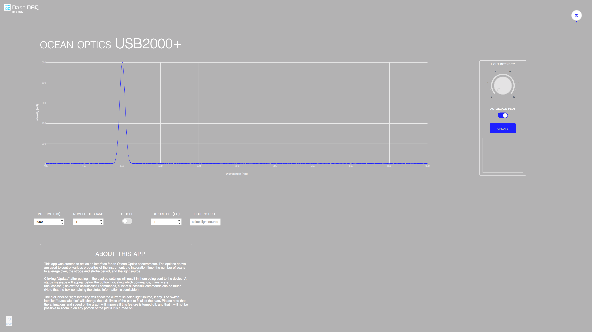
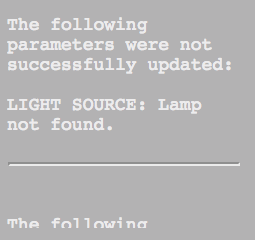

# dashr-ocean-optics
## Introduction
`dashr-ocean-optics` is a demo R app created to demonstrate controlling and reading data from [Ocean Optics](https://oceanoptics.com) spectrometers. Python version (contains also non-demo version) of the application can be found [here](https://github.com/plotly/dash-ocean-optics).

### Absorption Spectroscopy
Certain wavelengths of electromagnetic radiation correspond to frequencies that allow the electrons in certain atoms to transition to higher or lower energy levels; as these wavelengths are absorbed by the sample, the resulting spectrum can yield insight into the chemical composition of the sample. Read more about spectroscopy [here](https://en.wikipedia.org/wiki/Spectroscopy). 

### dash-daq
[Dash DAQ](http://dash-daq.netlify.com/#about) is a data acquisition and control package built on top of Plotly's [Dash](https://plot.ly/products/dash/).

## How to Run the App 

Clone the git repo:

```
git clone https://github.com/plotly/dash-sample-apps
cd dash-sample-apps/apps/dashr-ocean-optics
```
Run `Rscript init.R` to install all of the required packages

Run `Rscript app.R`:

The app will load into your default browser window. If it does not, navigate to 127.0.0.1:8050. You should see something like this: 



The demo spectrometer data should appear on the plot, and the model of the spectrometer should appear above the plot. Note that the "autoscale" feature is on by default. To improve the speed and animations of the graph, it is necessary to turn this feature off. 


The controls below the plot will allow you to change parameters of the spectrometer. The dial labelled "light intensity" to the right of the plot will allow you to adjust the intensity of the light source selected below. Note that the dial is disabled until a light source is selected from the appropriate dropdown menu.


### Controls
* int. time (us) - The integration time, in microseconds.
* number of scans - The number of scans to average over.
* strobe - Enables/disables the continuous strobe.
* strobe pd. (us) - The period of the continuous strobe, in microseconds.
* light source - The light source to be used.


Once they have been changed to the appropriate settings, the "update" button to the right of the plot should be pressed, and each of the settings will be sent to the spectrometer one-by-one. The window below the "update" button displays the commands that failed, with the associated error messages, and the commands that succeeded, with the new values.




Note that the window below the update button is scrollable!

## Advanced

### Configuring the colours
The colours for all of the Dash and Dash-DAQ components are loaded from `colors.txt`. Note that if you want to change the appearance of other components on the page, you'll have to link a different CSS file in `app.R`.

### Adding your own controls
In order to add a control yourself, you must:
* Create a new control object in `app.R`; note that the new object must have the key `id` in order for the callbacks to be properly triggered.
* Append this new object to the list `controls` within `app.R`.
After the above steps, new controller should be available in user-interface and can also be submitted upon clicking on `update` button. For additional functionality edit the `callbacks` as required. 
